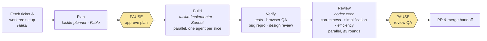

# skills

Made by Dylan.

A portable copy of the `/tackle` workflow (ticket → plan → build → review → PR),
generalized out of a specific monorepo so it can be reused on another project.

Uses both Anthropic and OpenAI models: Claude (Fable/Sonnet/Haiku) plans,
implements, and orchestrates the whole run, while OpenAI's Codex (`codex exec`)
runs as an independent second opinion in the local review loop.

## Principles

1. **Human in the loop for planning and verifying — AI for the rest.** The
   user only has to approve the plan and sign off on the QA evidence.
2. **The system compounds.** A "distill lessons" step at the end of each run
   writes durable, verified lessons back into `docs/architecture/` and rules
   files, so mistakes made once become checks the next plan is held to.
3. **The right model for the job, and a second model checking the first.**
   Fable plans alone; Sonnet implements in parallel, slice by slice; Codex —
   a different vendor's model — reviews Claude's own diff, catching what
   Claude is unlikely to catch in its own work.

## How to use it

1. Copy `.claude/` and `docs/` into your project (see [What's here](#whats-here)).
2. Read [Before you use this here](#before-you-use-this-here) and swap the
   project-specific pieces (ticket source, worktree setup, QA scripts, design
   skill) for your own.
3. Fill in `docs/architecture/principles.md` with your project's real
   principles — `tackle-planner` checks every plan against it.
4. Have `gh` and Codex CLI (`codex`) installed and authenticated — Phase 5's
   review loop shells out to `codex exec`.
5. Run `/tackle <ticket URL or key>` (or a free-text title). It runs end to
   end and only stops twice: to get your plan approved, and to hand you the
   QA evidence before opening a PR.

## Diagram



## What's here

```
.claude/
  commands/tackle.md       the /tackle slash command
  agents/
    tackle-planner.md      plans a ticket before any code is written
    tackle-implementer.md  implements one slice of an approved plan
docs/
  architecture/principles.md   stub — fill in this project's real principles
  adr/template.md               stub — copy this to write a new ADR
```

## Before you use this here

`tackle.md` still has some pieces from its original project that won't work
as-is in a new one:

- Ticket source is hardcoded to Linear
- Worktree setup calls a monorepo-specific `setup.sh` script
- QA/review steps call `scripts/qa/*` scripts that don't exist here
- Design review loads a `project-frontend-design` skill that doesn't exist here

Swap those out for whatever this project actually uses (its own ticket
tracker, its own test/lint commands, its own design rules, etc.) before
running `/tackle` for real.

## Everything else is generic

The two-pause structure (approve the plan, review the result), the
planner/implementer agent split, "don't stop between phases," and the overall
review/verify/PR loop shape all carry over as-is.

## Phases

Never stops between phases except at the two pauses.

| Phase | What happens | Model | Parallel? |
|-------|--------------|-------|-----------|
| Setup | Fetch the ticket, create the worktree | Haiku | — |
| Plan | `tackle-planner` explores the code, writes the plan | **Fable** | — |
| *pause* | user approves the plan | — | — |
| Build | `tackle-implementer` builds each slice | **Sonnet** | ✅ one agent per slice |
| Verify | type-check/lint/tests, browser QA with before/after bug repro, design self-review | orchestrator | — |
| Review | local review against the diff, fix, re-review (≤3 rounds) | `codex exec` | ✅ multiple sessions |
| *pause* | user reviews QA evidence | — | — |
| PR | push, open PR, attach QA evidence, merge handoff | orchestrator | — |

The command names *agent types* (`tackle-planner`, `tackle-implementer`),
never models — each agent's own definition pins its model, so routing stays
correct regardless of what model is running the orchestrator itself.

**What each review agent looks for:**

- **`tackle-planner` (Fable)** — checks the plan against architecture principles
  and ADRs, reuse of existing components, and correctness of the QA plan itself.
  It never touches code, only reads it.
- **`tackle-implementer` (Sonnet)** — self-reviews its own slice before
  reporting back: design-system values only (no improvised colors/spacing),
  scope creep, and whether every screen state (empty/loading/error) is handled.
- **Design self-review (Verify phase, Claude)** — looks at rendered screenshots,
  not source: visual restraint (no redundant text, information revealed only
  when needed), correct component choice, spacing/type from the design scale.
- **`codex exec` (Review phase, OpenAI)** — an independent second opinion on the
  committed diff, focused on **correctness bugs** and **reuse/simplification/
  efficiency** cleanups — deliberately not the same lens as Claude's own review,
  so it catches what Claude is more likely to miss in its own work.

